# Методические указания по выполнению домашнего задания iOS

### Команда курса благодарит Курганову Александру и Федорову Антонину за активное участие в подготовке данного руководства.

! Данное методическое указание подходит только для устройств с операционной системой macOS !

# План

1. Установка
2. Создание проекта
3. Организация структуры проекта
4. Запуск и отладка приложения
5. Добавление таблицы на экран
6. Веб сервис
    1. Подкючение приложения к собственному сервису
    2. Обработка подключения к сервису
7. Экран детальной информации
    1. Переход на экран с детальной информацией
    2. Заполнение данныеми экрана детальной информации
    3. Верстка экрана детальной информации
8. Полезные ссылки

# Установка

Зайти на [сайт](https://xcodereleases.com) и открыть вкладку `Releases`. Найти `Xcode`, совместимый с вашим устройством. Или можно зайти в `AppStore` и скачать там `Xcode`.
После установки `Xcode` необходимо зарегистрировать собственный `AppleID` для подписи приложения.
Для этого открыть `Xcode->Preferences->Accounts`, нажать на кнопку `+` и выбрать `AppleID`.


# Создание проекта

В данном пункте мы создадим пустой проект.
Открыть `Xcode` и нажать `Create a new Xcode project`.

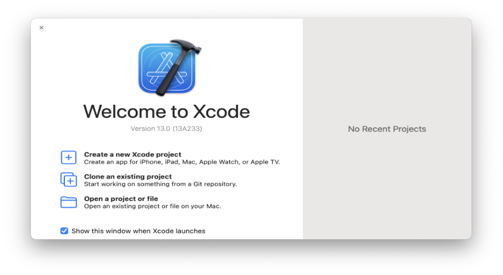

Выбрать вкладку `iOS` и нажать `App` и `Next`.

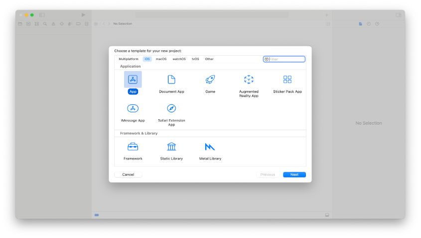

Настройки по вкладкам: 
`Product Name` – указать название разрабатываемого приложения.
`Team` – выбрать добавленный ранее `AppleID`.
`Organization Identifier` – также указать свой `AppleID`.
`Bundle Identifier` конфигурируется автоматически, менять его не нужно.
`Interface` – `Storyboard`
Language: `Swift`
Снимаем галочки с полей `Core Data` и `Include Tests`.
Нажать `Next`.


Для создания папки в проекте необходимо нажать ПКМ на иконку проекта слева и выбрать `New Group`.

# Организация структуры проекта
Для того, чтобы в проекте была удобная и понятная навигация между файлами – необходимо научиться грамотно создавать структуру папок, по которым будем раскладывать файлы с кодом для наших экранов, запросов в сеть и прочего. Для того, чтобы создать новую папку – необходимо кликнуть правой кнопки мыши по папки, в который вы хотите создать новую и выбрать пункт `New Group`.

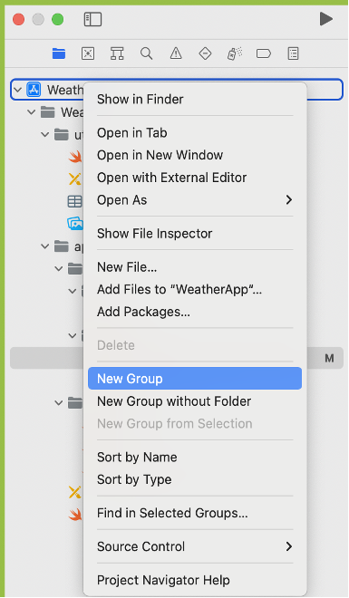

При создании проекта `Xcode` автоматически сгенерирует файл `ViewController.swift`, который является экраном, с которого запускается приложение. Его следует переименовать в соответствии с вашей предметной областью. В нашем случае это `WeatherViewConroller`.
Далее необходимо создать папки и файлы и сортировать их следующим образом:
в папку `utils` поместить вспомогательные файлы, такие как: 
`AppDelegate.swift/SceneDelegate.swift` (стартовый файл приложения)
`MainStoryboard.swift` (отображает главный экран приложения при использовании `Storyboards`)
`Info.plist` (необходим для задания структуры и параметров проекта)
в папке `app` расположить основной код проекта:
в папке `service` поместить файлы для работы с API.
в папку `ViewController` поместить все файлы, относящиеся визуальным представлениям приложения.

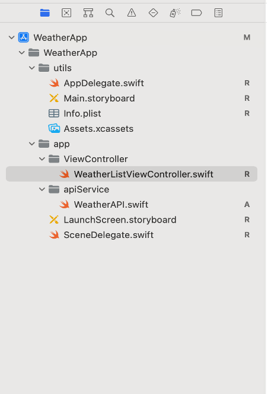

Примечание: в `Swift` принято `CamelCase` наименование с максимально подробным описанием, например: `WeatherViewController`  при создании `View Controller`, `WeatherTableViewCell` при создании ячейки таблицы, `downloadWeatherDataFromWeatherApiService` при скачивании данных с определенного (в данном случае погодного) API сервиса.
Для удаления папки или файла из проекта необходимо нажать ПКМ или сочетание клавиш `Command+backspace`, выбрать `Delete` и в открывшемся диалоговом окне выбрать `Move to Trash`.
После организации структуры проекта необходимо его собрать. Для этого нажать в верхней панели `Xcode` `Product->Build` (`Command+B`).
Если вы перемещали файл `Info.plist` из корня проекта, то проект не соберется и появится ошибка: `Build input file cannot be found`.

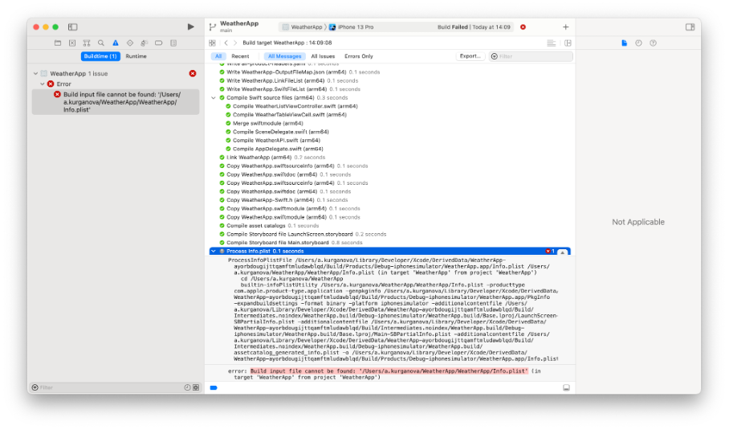

Для решения данной ошибки необходимо нажать на иконку проекта в левом меню, перейти на вкладку `Build Settings` и в поиске набрать `plist`.


В разделе `Packaging` пункта `Info.plist File` необходимо 2 раза щелкнуть ЛКМ на расположение файла `info.plist`, прописать там новый путь до этого файла и нажать `Enter`.

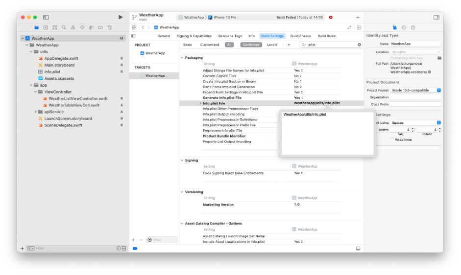

После этого проект должен собираться без ошибок.
Также можно выбрать устройство, с которого будет запускаться приложение путем нажатия на панель изображенную ниже:


# Запуск и отладка приложения
В данном пункте мы сделаем первоначальные настройки проекта, которые позволят нам запустить проект на симуляторе и убедиться в том, что все работает.
Примечание:
Данное домашнее задание выполнено с использованием архитектуры MVC.
Для того, чтобы узнать версию iOS, начиная с которой будет работать приложение необходимо нажать на иконку проекта слева, в разделе `Targets` выбрать соответствующее приложение, перейти во вкладку `General` в раздел `Deployment Info`.

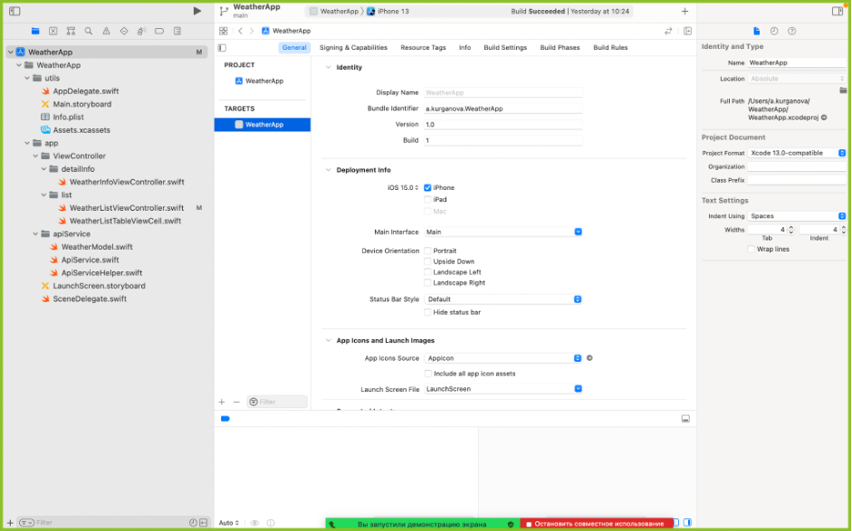

Если у вас в настройках проекта выбрана iOS 13.0 и позднее, то следующие действия необходимо выполнять в файле `SceneDelegate.swift`.
В файле `SceneDelegate.swift` необходимо выбрать функцию

```swift
 func scene(_ scene: UIScene, willConnectTo session: UISceneSession, options connectionOptions: UIScene.ConnectionOptions) 
```

и написать следующий код:


На 21 строке при установке root контроллера необходимо написать имя `View Controller`, который должен запускаться первым.

Если у вас в настройках проекта выбрана iOS 12.4 и ранее, то в файле `AppDelegate.swift` необходимо выбрать функцию 
```swift
func application(_ application: UIApplication, didFinishLaunchingWithOptions launchOptions: [UIApplication.LaunchOptionsKey: Any]?) -> Bool
```
и написать следующий код:


После этого в файле `WeatherViewController.swift` в функции `viewDidLoad` можно указать 

```swift
view.backgroundColor = .red
```
и запустить приложение через `Produt->Run` (`Command+R`). Должен открыться симулятор и приложение, у которого фон будет красным.


Если этого не произошло, можно воспользоваться инструментом `Debug View Hierarchy` для просмотра UI элементов.


После открытия дебаггера и во время его работы симулятор будет заблокирован.
Откроется иерархия UI классов приложения, расположенных в дереве:

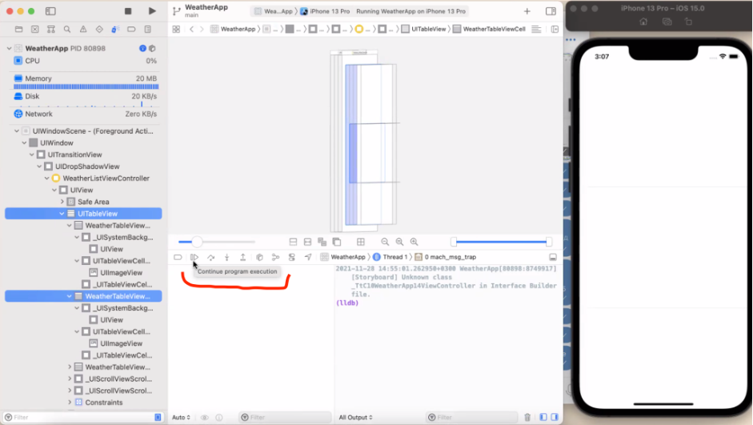

В нем можно просмотреть основную информацию о расположении и свойствах всех UI-элементов, добавленных в ваше приложение. Для выхода из `debugger` необходимо надать кнопку `Continue` на нижней панели.


# Добавление таблицы на экран
Сейчас мы добавим на экран таблицу, в которой в будущем сможем отобразить информацию по выбранной тематике, которая придет с бэкенда. Зададим все первоначальные настройки для того, чтобы смогли собрать приложение без ошибок и увидеть, что пустая таблица, действительно добавилась на экран. 
Для улучшения UI/UX можно установить заголовок для экрана с помощью функции `setupNavigation()`,

```swift
private func setupNavigation() {
        navigationItem.title = "Список городов"
    }
```
которую вызовем во `viewDidLoad()`:
```swift
override func viewDidLoad() {
        super.viewDidLoad()
        view.backgroundColor = .white
        setupNavigation()
    }
```

Для того, чтобы на экране отобразилась таблица, необходимо создать переменную класса `WeatherViewController` типа `UITableView` и задать там первичные настройки: флаг `translatesAutoresizingMaskIntoConstraints`, `delegate`, `dataSource`, `register` и `estimatedRowHeight`.

```swift
private lazy var weatherListTableView: UITableView = {
        let tableView = UITableView()
        tableView.translatesAutoresizingMaskIntoConstraints = false
        tableView.delegate = self
        tableView.dataSource = self
        tableView.register(WeatherListTableViewCell.self, forCellReuseIdentifier: "listCell")
        tableView.estimatedRowHeight = view.bounds.height / 3
        return tableView
    }()
```
После этого необходимо добавить таблицу на `view`, которая уже есть у любого `ViewController`.
Добавление таблицы и последующая верстка происходит с помощью механизма `Auto Layout`. 
Оборачиваем код в функцию и вызваем ее во `viewDidLoad()`:

```swift
private func setupWeatherTableView() {
        view.addSubview(weatherListTableView)
        weatherListTableView.topAnchor.constraint(equalTo: view.safeAreaLayoutGuide.topAnchor).isActive = true
        weatherListTableView.bottomAnchor.constraint(equalTo: view.safeAreaLayoutGuide.bottomAnchor).isActive = true
        weatherListTableView.leftAnchor.constraint(equalTo: view.safeAreaLayoutGuide.leftAnchor).isActive = true
        weatherListTableView.rightAnchor.constraint(equalTo: view.safeAreaLayoutGuide.rightAnchor).isActive = true
    }
```

Вызов из `viewDidLoad()`:

```swift
override func viewDidLoad() {
        super.viewDidLoad()
        view.backgroundColor = .white
        setupNavigation()
        setupWeatherTableView()
    }
```

После добавления таблицы на `view` и заданием первичных настроек необходимо реализовать `delegate` и `dataSource` таблицы:

```swift
extension WeatherListViewController: UITableViewDelegate {
    func numberOfSections(in tableView: UITableView) -> Int { // количество секций в таблице
        1
    }
}
```
```swift
extension WeatherListViewController: UITableViewDataSource {
    func tableView(_ tableView: UITableView, numberOfRowsInSection section: Int) -> Int { // количество строк в секции
        weatherListData.count
    }
}
```

Примечание:
`weatherListData` –поле класса в `WeatherListViewController` типа массив с данными о погоде, которые придут с сервиса в структуре `WeatherData`:

```swift
private var weatherListData: [WeatherData] = []
```
Для установки ячейки в таблицу необходимо создать новый файл, отвечающий за нее: `WeatherListTableViewCell.swift`

```swift
import Foundation
import UIKit

final class WeatherListTableViewCell: UITableViewCell {
    override init(style: UITableViewCell.CellStyle, reuseIdentifier: String?) {
        super.init(style: style, reuseIdentifier: reuseIdentifier)
    }
    
    required init?(coder: NSCoder) {
        fatalError("init(coder:) has not been implemented")
    }
}
```

и поместить в нее функцию, которая будет отвечать за заполнение ячейки данными:     
```swift
func configure(withModel weather: WeatherData) {
        textLabel?.text = weather.location.country
    }
```

Примечание: `textLabel` – поле, существующее по умолчанию только у классов типа `UITableViewCell`.
Вызвать данную функцию необходимо в `extension WeatherListViewController: UITableViewDataSource`

```swift
  func tableView(_ tableView: UITableView, cellForRowAt indexPath: IndexPath) -> UITableViewCell { // установка ячейки для таблицы
        guard let cell = tableView.dequeueReusableCell(withIdentifier: "listCell", for: indexPath) as? WeatherListTableViewCell else { return .init() }
        cell.configure(withModel: weatherListData[indexPath.row])
        return cell
    }
```

Далее можно запустить приложение и посмотреть на получившуюся таблицу либо в симуляторе (будут видны разделители секций), либо во `View Debug Hierarchy`:

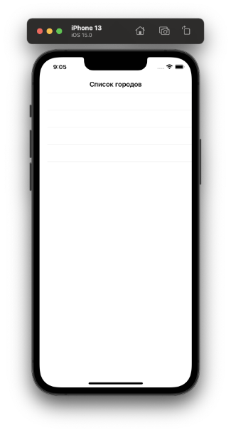

# Подключение приложения к собственному сервису

В данном пункте мы создадим модель данных, которая соответствует тому, что вы уже создали на бэкенде. В эту модель данных будет парситься `json`. Также мы создадим запрос к вашему сервису и сам парсинг ответа.

Прежде чем приступать к созданию подключения сервиса необходимо задать модель с данными, которые придут в ответе от сервиса.
Создадим их в отдельном файле `app->apiService->WeatherModel.swift`:
```swift
import Foundation

struct WeatherData: Codable {
    var location: Location
    var current: Current
}

struct Location: Codable {
    var name: String
    var country: String
    var region: String
}

struct Current: Codable {
    var observation_time: String
    var temperature: Int
    var wind_speed: Int
    var pressure: Int
    var feelslike: Int
}
```

Примечание: поля у структуры желательно должны быть такими же, как в `json` ответе. Если нужно переименовать поля, то следует воспользоваться `CodingKeys`.

После создания модели можно приступать к созданию своего типа запроса для соединения с сервисом. Также в отдельном файле. В данном случае `app->apiService->ApiServiceHelper.swift`: 
Создадим enum для удобного доступа к методам API:
```swift
enum ApiMethods: String {
    case get = "GET"
    case post = "POST"
}
```
Напишем функцию для генерации определенного запроса:
```swift
func configureURLRequest(city: String) -> URLRequest {
    var request: URLRequest
    let acsessToken: String = "b849bbbe085e655065bb8546ec2a8dd5" // нужен для weather-api

    let queryItems = [
        URLQueryItem(name: "access_key", value: acsessToken),
        URLQueryItem(name: "query", value: "'\(city)'")
    ]
    guard var urlComponents = URLComponents(string: "http://api.weatherstack.com/current") else {
        // если не получится создать компоненты из своих query параметров, то переходим на google
        return URLRequest(url: URL(string: "https://google.com")!)
    }

    urlComponents.queryItems = queryItems

    guard let url = urlComponents.url else {
        // если не получится создать url из своего адреса, то переходим на google
        return URLRequest(url: URL(string: "https://google.com")!)
    }

    request = URLRequest(url: url)
    request.httpMethod = ApiMethods.post.rawValue // устанавливаем метод запроса через enum
    return request
}
```

Переходим к созданию запросов к собственному api сервису в отдельном файле: `app->apiService->ApiService.swift`: 
```swift
import Foundation

final class ApiService {
    
    func getWeatherData(city: String, completion: @escaping (WeatherData?, Error?)-> ()) {
        let request = configureURLRequest(city: city) // конфигурация кастомного запроса

        URLSession.shared.dataTask(with: request, completionHandler: { data, response, error in  // completionHandler – замыкание для обработки  данных  в другом слое (в данном случае  view controller)

            if let error = error {
                print("error")
                completion(nil, error) 
            }
            if let response = response {
                print(response)
            }
            guard let data = data else {
                completion(nil, error)
                return
            }

            do {
                let weatherData = try JSONDecoder().decode(WeatherData.self, from: data) //декодируем json в созданную струткру с данными
                completion(weatherData, nil)
            } catch let error {
                completion(nil, error)
            }
        }).resume() // запускаем задачу
    }
}
```

# Обработка подключения к сервису
Теперь мы научимся кидать запрос к сервису из нашего экрана, получать и обрабатывать ответ, после чего добавим полученный ответ на экран и отобразим его в таблице. 

Примечание: из-за ограничений API для получения списка городов пришлось запустить запрос для получения одного города несколько раз.
Для обработки подключения к сервису необходимо вернуться в файл `WeatherViewController.swift` и создать там экземпляр `apiService`:
```swift
private var apiService: ApiService?
```
и проинициализировать его во `viewDidLoad()`:
```swift
override func viewDidLoad() {
        super.viewDidLoad()
        view.backgroundColor = .white
        setupNavigation()
        setupWeatherTableView()

        apiService = ApiService()
        loadWeatherData(cities: ["New York", "Moscow", "London", "Berlin"])
    }
```
и проинициализировать его во `viewDidLoad()`:
```swift
private func loadWeatherData(cities: [String]) {
        guard let apiService = apiService else { // раскрытие опциональной переменной apiService
            return
        }

        cities.forEach { 
            apiService.getWeatherData(city: $0, completion: { [weak self] (weatherData, error) in // weak self для избежания цикла сильных ссылок из-за замыкания completion
                DispatchQueue.main.async { // запуск асинхронной задачи на main потоке из-за обработки на ui !!!
                    guard let self = self else { return }
                    if let error = error {
     // показ ошибки
                        self.present(UIAlertController(title: "ERROR", message: error.localizedDescription, preferredStyle: .alert), animated: true)
                        return
                    }
                    if let weatherData = weatherData {
                        self.weatherListData.append(weatherData) // массив с данными о погоде
                    }
                    self.weatherListTableView.reloadData() // перезагрузка таблицы для отображения новых данных
                }
            })
        }
    }
```

Запускаем приложение на симуляторе и видим данные, пришедшие с сервиса, отображенные в таблице:
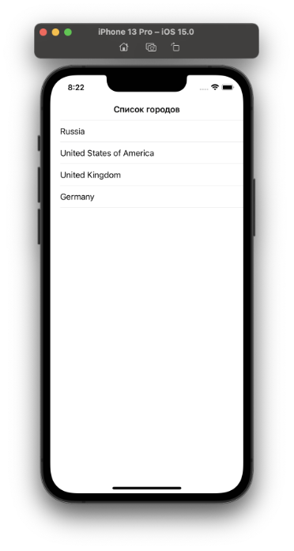

# Переход на экран с детальной информацией
Следующей частью задания является создание второго экрана с детальной информацией о каждом объекте из списка объектов, которые пришли нам с сервиса. Для этого мы создадим второй `viewController`, расширим делегат для таблицы на первом экране с реализацией перехода на новый второй экран с возможностью передачи данных между экранами.
Для перехода из таблицы на другой экран необходимо создать еще один `UIViewController` `app-> ViewController->detailInfo->WeatherInfoViewController.swift` и передать в него данные о погоде одного города через инициализатор:
```swift
import Foundation
import UIKit

final class WeatherInfoViewController: UIViewController {
    private var weatherData: WeatherData

    override func viewDidLoad() {
        super.viewDidLoad()
    }
    
    init(weatherData: WeatherData) {
        self.weatherData = weatherData
        super.init(nibName: nil, bundle: nil)
    }
}
```

Далее необходимо добавить переход на данный экран с основного. Делается это с помощью добавления метода делегата таблицы `didSelectRowAt` в `extension WeatherListViewController: UITableViewDelegate`
```swift
func tableView(_ tableView: UITableView, didSelectRowAt indexPath: IndexPath) {
        let weatherInfoViewController = WeatherInfoViewController(weatherData: self.weatherListData[indexPath.row])
        navigationController?.pushViewController(weatherInfoViewController, animated: true)
    }
```

# Заполнение данными экрана детальной информации
Создадим функцию, которая будет сохранять в текстовые лейблы значения строк с детальной информацией об объекте, которые мы передали с первого экрана.
Заполнение этого экрана данными происходит через функцию `fillData(withModel: weatherData)`:
```swift
  func fillData(withModel: WeatherData) {
        degreeLabel.text =  "Temperature: " + String(withModel.current.temperature)
        windLabel.text = "Wind speed: " + String(withModel.current.wind_speed)
        pressureLabel.text = "Pressure: " + String(withModel.current.pressure)
        feelslikeLabel.text = "Feels like: " + String(withModel.current.feelslike)
    }
```
которая вызывается из инициализатора контроллера и поле класса `weatherData`:
```swift
private var weatherData: WeatherData

init(weatherData: WeatherData) {
        self.weatherData = weatherData
        super.init(nibName: nil, bundle: nil)
        fillData(withModel: weatherData)
    }
```


# Верстка экрана детальной информации
Здесь мы научимся создавать чуть более сложную верстку, чем у нас была на первом экране. Для этого добавим на экран элементы, которые хотим отобразить и зададим для них констрейнты.
Для добавления картинки в приложение необходимо зайти в папку `Assets.xcassets`, перетащить туда картинку и в правой панели `Xcode` во вкладке `Devices` нажать галочку `Universal`:


Примечание: для удаление картинки из assets необходимо нажать ПКМ и выбрать `Delete selected items`  или на клавиатуре клавишу `backspace`.

Верстка экрана с детальной информацией:

```swift
import Foundation
import UIKit

final class WeatherInfoViewController: UIViewController {
//добавим на экран элементы, которые хотим отобразить на экране
    private let imageView = UIImageView()
    private let degreeLabel = UILabel()
    private let windLabel = UILabel()
    private let pressureLabel = UILabel()
    private let feelslikeLabel = UILabel()

//создадим переменную для хранения детальной информации об объекте
    private var weatherData: WeatherData

    override func viewDidLoad() {
        super.viewDidLoad()
        configure()
        configureDataElements()
    }
    
    init(weatherData: WeatherData) {
        self.weatherData = weatherData
        super.init(nibName: nil, bundle: nil)
        fillData(withModel: weatherData)
    }
    
    private func configure() {
        view.backgroundColor = .systemBlue
        navigationController?.navigationBar.tintColor = .white
        navigationController?.navigationBar.titleTextAttributes = [.foregroundColor: UIColor.white]
        navigationItem.title = weatherData.location.country // установка заголока контроллера: название города
    }
    
//зададим базовые настройки для текстовых полей и добавим их на экран 
    private func configureDataElements() {
        [degreeLabel, windLabel, pressureLabel, feelslikeLabel].forEach {
            $0.translatesAutoresizingMaskIntoConstraints = false
            $0.font = UIFont.systemFont(ofSize: 20, weight: .bold)
            $0.textColor = .white
            view.addSubview($0)
        }
        
//зададим констрейнты и базовые настройки для картинки
        imageView.translatesAutoresizingMaskIntoConstraints = false
        view.addSubview(imageView)
        imageView.heightAnchor.constraint(equalToConstant: 250).isActive = true
        imageView.widthAnchor.constraint(equalToConstant: 200).isActive = true
        imageView.leftAnchor.constraint(equalTo: view.leftAnchor, constant: 5).isActive = true
        imageView.topAnchor.constraint(equalTo: view.safeAreaLayoutGuide.topAnchor).isActive = true
        
        imageView.image = UIImage(named: "sunny")
        
//зададим констрейнты для всех текстовых полей
        degreeLabel.leftAnchor.constraint(equalTo: imageView.rightAnchor).isActive = true
        degreeLabel.topAnchor.constraint(equalTo: imageView.centerYAnchor, constant: -10).isActive = true
        
        windLabel.centerXAnchor.constraint(equalTo: view.centerXAnchor).isActive = true
        windLabel.centerYAnchor.constraint(equalTo: view.centerYAnchor).isActive = true

        pressureLabel.centerXAnchor.constraint(equalTo: view.centerXAnchor).isActive = true
        pressureLabel.centerYAnchor.constraint(equalTo: windLabel.bottomAnchor, constant: 100).isActive = true
        
        feelslikeLabel.centerXAnchor.constraint(equalTo: view.centerXAnchor).isActive = true
        feelslikeLabel.centerYAnchor.constraint(equalTo: pressureLabel.bottomAnchor, constant: 100).isActive = true
    }

    required init?(coder: NSCoder) {
        fatalError("init(coder:) has not been implemented")
    }
}
```

Запускаем приложение, нажимаем на ячейку в таблице и попадаем на экран с детальной информацией:
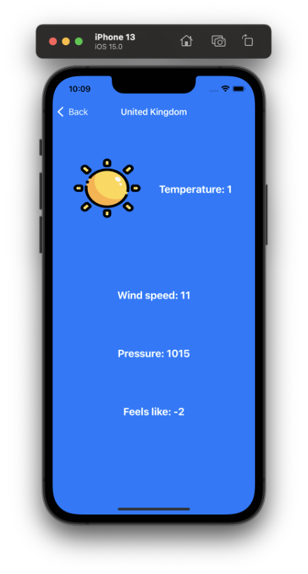

# Полезные ссылки

1. [Книга по Swift](https://docs.swift.org/swift-book/)
2. [Перевод книги из первой ссылки](https://swiftbook.ru/contents/doc/)
